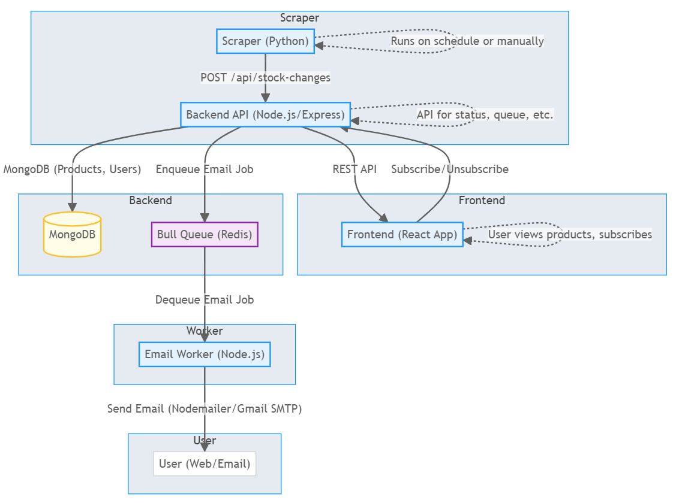

# Amul Protein Products Notifier

A web application that helps users get notified when Amul protein products are restocked in their area. Users can subscribe to specific products and receive email notifications when they become available.

## 🌐 Live Website

**Access the project website:** [https://amul-protein-products-notifier.onrender.com](https://amul-protein-products-notifier.onrender.com)

## 📋 Project Overview

This application consists of three main components:

- **Frontend**: React.js web application for user interface
- **Backend**: Node.js/Express API server
- **Scraper**: Python-based web scraper for monitoring Amul product availability

## 🏗️ System Architecture



_System Architecture showing the interaction between Frontend, Backend, Scraper, and external services_

## ✨ Features

- **Product Subscription**: Users can subscribe to specific Amul protein products
- **City-based Service**: Currently available for Delhi, Haryana, Karnataka, and Maharashtra
- **Email Notifications**: Automatic email alerts when products are restocked
- **Subscription Management**: Users can edit or unsubscribe from their subscriptions through secure email links
- **Real-time Product Monitoring**: Automated scraping of Amul's website for product availability

## 🗺️ Supported Areas

The service is currently available in the following cities:

- **Delhi** - Capital region
- **Haryana** - Gurgaon and surrounding areas
- **Karnataka** - Bangalore and surrounding areas
- **Maharashtra** - Mumbai and surrounding areas

## 🛠️ Technology Stack

### Frontend

- React.js
- React Router DOM
- CSS3

### Backend

- Node.js
- Express.js
- MongoDB (Mongoose)
- Redis (Bull Queue)
- Nodemailer

### Scraper

- Python
- FastAPI
- Selenium/BeautifulSoup

## 🚀 Getting Started

### Prerequisites

- Node.js (v14 or higher)
- MongoDB
- Redis
- Python 3.8+

### Local Development Setup

1. **Clone the repository**

   ```bash
   git clone <repository-url>
   cd amul_products_notifier
   ```

2. **Backend Setup**

   ```bash
   cd backend
   npm install
   cp env_example.txt .env
   # Edit .env with your configuration
   npm run dev
   ```

3. **Frontend Setup**

   ```bash
   cd frontend
   npm install
   cp env_example.txt .env
   # Edit .env with your configuration
   npm start
   ```

4. **Scraper Setup**
   ```bash
   cd scraper
   pip install -r requirements.txt
   cp env_example.txt .env
   # Edit .env with your configuration
   python main.py
   ```

### Environment Configuration

#### Backend (.env)

```env
EMAIL_USER=
EMAIL_PASSWORD=
MONGO_URI=
FRONTEND_BASE_URL=
REDIS_URL=
PORT=
```

#### Frontend (.env)

```env
REACT_APP_BACKEND_API_BASE=
```

#### Scraper (.env)

```env
BACKEND_API_BASE=
PIN_CODE=
MONGO_URI=
HEADLESS_MODE=
PORT=
```

## 🔄 How It Works

### **System Overview**

The Amul Protein Products Notifier operates as a complete monitoring and notification system with three main components working together:

1. **Frontend (React.js)**: User interface for subscription management
2. **Backend (Node.js)**: API server handling business logic and email processing
3. **Scraper (Python)**: Automated web scraper monitoring Amul's website

### **Data Flow Process**

#### **1. User Subscription Flow**

```
User Input → Frontend → Backend API → MongoDB Database
     ↓
Email + City + Products → Validation → Storage → Confirmation Email
```

#### **2. Product Monitoring Flow**

```
Amul Website → Python Scraper → Backend API → Stock Change Detection
     ↓
Product Data → Comparison → Queue → Email Notifications
```

#### **3. Notification Flow**

```
Stock Change Detected → Redis Queue → Email Service → User Inbox
     ↓
Background Processing → Retry Logic → Delivery Confirmation
```

### **Technical Workflow**

#### **Subscription Management**

- **Email Validation**: Users enter email to check existing subscriptions
- **City Selection**: Dropdown with Delhi, Haryana, Karnataka, and Maharashtra options
- **Product Selection**: Categorized product list (Milkshakes, Paneer, Whey Protein, etc.)
- **Data Storage**: User preferences stored in MongoDB with unique tokens
- **Email Confirmation**: Welcome email with edit/unsubscribe links

#### **Automated Monitoring**

- **Web Scraping**: Python scraper monitors Amul's protein products page
- **Stock Detection**: Identifies products marked as "SOLD OUT" vs available
- **Change Detection**: Compares current stock status with previous data
- **Data Processing**: Sends stock changes to backend for processing
- **Uptime Robot Service**: External monitoring service calls the `/scrape` endpoint every 10 minutes to maintain continuous operation

### **Scraper Details**

#### **What the Scraper Does**

The Python scraper is the core monitoring component that:

- **Monitors Amul's Website**: Continuously checks the protein products page at `https://shop.amul.com/en/browse/protein`
- **Handles PIN Code Entry**: Automatically enters the configured PIN code (122003 for Haryana, 110036 for Delhi, 560001 for Karnataka, and 400001 for Maharashtra) to access location-specific product availability
- **Extracts Product Data**: Scrapes all protein products including:
  - Product names and IDs
  - Current stock status (Available/Sold Out)
  - Product categories and descriptions
  - Pricing information (when available)
- **Detects Stock Changes**: Compares current stock status with previously stored data to identify:
  - Products that were "Sold Out" but are now "Available"
  - Products that were "Available" but are now "Sold Out"
- **Sends Data to Backend**: Transmits scraped data to the Node.js backend for processing

#### **How the Scraper Works**

##### **1. Initialization Process**

```
Start Scraper → Load Configuration → Initialize Selenium WebDriver → Navigate to Amul Website
```

##### **2. PIN Code Entry**

```
Locate PIN Input Field → Enter Configured PIN Code → Submit → Wait for Page Load
```

##### **3. Product Scraping**

```
Parse HTML → Extract Product Elements → Identify Stock Status → Store Product Data
```

##### **4. Data Processing**

```
Compare with Previous Data → Identify Changes → Filter Relevant Products → Send to Backend
```

##### **5. Error Handling**

```
Network Issues → Retry Logic → Logging → Alert System
```

#### **Technical Implementation**

- **Selenium WebDriver**: Uses Chrome/Chromium browser automation for dynamic content
- **BeautifulSoup**: HTML parsing for extracting product information
- **Multiple Selectors**: Implements various CSS selectors to handle website structure changes
- **Headless Mode**: Can run without browser UI for server deployment
- **Rate Limiting**: Respects website load by implementing delays between requests
- **Logging System**: Comprehensive logging for debugging and monitoring

#### **Scraping Strategy**

- **Robust Selectors**: Uses multiple CSS selectors to handle different page layouts
- **Fallback Mechanisms**: If primary selectors fail, tries alternative methods
- **Data Validation**: Validates scraped data before sending to backend
- **Incremental Updates**: Only processes products that have changed status
- **Error Recovery**: Automatically retries failed scraping attempts

#### **Monitoring Schedule**

- **Continuous Mode**: Runs indefinitely with configurable intervals (default: 60 seconds)
- **Single Run Mode**: Executes once for testing purposes
- **Configurable Timing**: Adjustable intervals based on requirements
- **Background Operation**: Designed to run as a background service
- **Uptime Robot Integration**: The `/scrape` endpoint is called every 10 minutes by Uptime Robot service to ensure continuous monitoring and prevent the scraper from going idle

#### **Email Notification System**

- **Queue Management**: Redis Bull Queue handles email processing
- **Background Jobs**: Asynchronous email sending to prevent blocking
- **Retry Logic**: Automatic retry for failed email deliveries
- **Rate Limiting**: Prevents email spam and respects SMTP limits

#### **Subscription Management**

- **Token-based Links**: Secure edit and unsubscribe links in emails
- **Real-time Updates**: Users can modify products and city preferences
- **One-click Unsubscribe**: Immediate removal from notification list

### **Architecture Benefits**

- **Scalability**: Microservices architecture allows independent scaling
- **Reliability**: Queue system ensures no notifications are lost
- **User Experience**: Simple city selection instead of complex pincode validation
- **Maintainability**: Clear separation of concerns between components
- **Security**: Token-based authentication for subscription management

## 📱 How to Use

1. **Visit the website**: [https://amul-protein-products-notifier.onrender.com](https://amul-protein-products-notifier.onrender.com)

2. **Enter your email address** to check if you have an existing subscription

3. **Select your city** from the supported areas

4. **Choose products** you want to be notified about:

   - Milkshakes
   - Paneer
   - Whey Protein
   - Lassi
   - Buttermilk
   - Milk
   - Other products

5. **Subscribe** and receive email notifications when products are restocked

6. **Manage your subscription** through secure links provided in email notifications (editing is only available via email links)

## 🔧 API Endpoints

- `GET /api/products` - Get available products
- `POST /api/subscribe` - Subscribe to products
- `GET /api/user/:email` - Get user subscription
- `PUT /api/user/:email` - Update subscription
- `DELETE /api/user/:email` - Unsubscribe
- `POST /api/verify-pincode` - Verify pincode availability

## 📧 Email Notifications

The system automatically sends email notifications when:

- Products are restocked in the user's area
- Subscription is created/updated
- Unsubscribe confirmation

## 🤝 Contributing

1. Fork the repository
2. Create a feature branch
3. Make your changes
4. Test thoroughly
5. Submit a pull request

## 📄 License

This project is licensed under the MIT License.

## 📞 Support

For support or questions, please contact the development team or create an issue in the repository.

---

**Note**: This service is specifically designed for Delhi, Haryana, Karnataka, and Maharashtra areas and monitors Amul protein product availability. The scraper runs periodically to check for product restocks and sends notifications to subscribed users.
