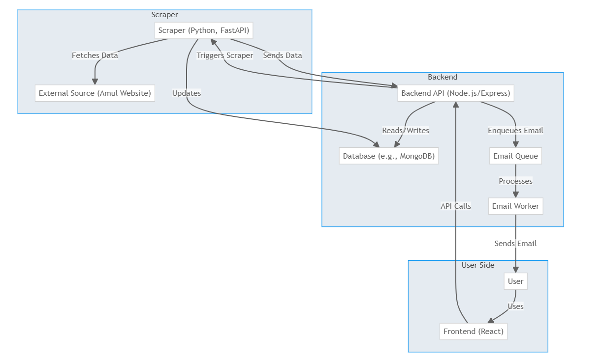

# Amul Protein Products Notifier

A web application that helps users get notified when Amul protein products are restocked in their area. Users can subscribe to specific products and receive email notifications when they become available.

## 🌐 Live Website

**Access the project website:** [https://amul-protein-products-notifier.onrender.com](https://amul-protein-products-notifier.onrender.com)

## 📋 Project Overview

This application consists of three main components:

- **Frontend**: React.js web application for user interface
- **Backend**: Node.js/Express API server
- **Scraper**: Python-based web scraper for monitoring Amul product availability

## 🏗️ System Architecture



_System Architecture showing the interaction between Frontend, Backend, Scraper, and external services_

## ✨ Features

- **Product Subscription**: Users can subscribe to specific Amul protein products
- **Pincode-based Service**: Currently available for Gurgaon area pincodes
- **Email Notifications**: Automatic email alerts when products are restocked
- **Subscription Management**: Users can edit or unsubscribe from their subscriptions
- **Real-time Product Monitoring**: Automated scraping of Amul's website for product availability

## 🗺️ Supported Areas

The service is currently available for the following Gurgaon pincodes(all except 122106):

- 110036, 122001, 122002, 122003, 122004, 122005, 122006, 122007, 122008, 122009, 122010, 122011, 122015, 122016, 122017, 122018, 122051, 122052, 122101, 122102, 122103, 122104, 122105, 122107, 122108, 122413, 122414, 122502, 122503, 122504, 122505, 122506, 122508, 123106, 123401

## 🛠️ Technology Stack

### Frontend

- React.js
- React Router DOM
- CSS3

### Backend

- Node.js
- Express.js
- MongoDB (Mongoose)
- Redis (Bull Queue)
- Nodemailer

### Scraper

- Python
- FastAPI
- Selenium/BeautifulSoup

## 🚀 Getting Started

### Prerequisites

- Node.js (v14 or higher)
- MongoDB
- Redis
- Python 3.8+

### Local Development Setup

1. **Clone the repository**

   ```bash
   git clone <repository-url>
   cd amul_products_notifier
   ```

2. **Backend Setup**

   ```bash
   cd backend
   npm install
   cp env_example.txt .env
   # Edit .env with your configuration
   npm run dev
   ```

3. **Frontend Setup**

   ```bash
   cd frontend
   npm install
   echo REACT_APP_BACKEND_API_BASE=http://localhost:8000/api > .env
   npm start
   ```

4. **Scraper Setup**
   ```bash
   cd scraper
   pip install -r requirements.txt
   # Configure environment variables
   python main.py
   ```

### Environment Configuration

#### Backend (.env)

```env
MONGO_URI=mongodb://localhost:27017/amul_products_notifier
REDIS_URL=redis://localhost:6379
EMAIL_USER=your-email@gmail.com
EMAIL_PASSWORD=your-app-password
PORT=8000
```

#### Frontend (.env)

```env
REACT_APP_BACKEND_API_BASE=http://localhost:8000/api
```

## 📱 How to Use

1. **Visit the website**: [https://amul-protein-products-notifier.onrender.com](https://amul-protein-products-notifier.onrender.com)

2. **Enter your email address** to check if you have an existing subscription

3. **Select your pincode** from the supported Gurgaon areas

4. **Choose products** you want to be notified about:

   - Milkshakes
   - Paneer
   - Whey Protein
   - Lassi
   - Buttermilk
   - Milk
   - Other products

5. **Subscribe** and receive email notifications when products are restocked

6. **Manage your subscription** through links provided in email notifications

## 🔧 API Endpoints

- `GET /api/products` - Get available products
- `POST /api/subscribe` - Subscribe to products
- `GET /api/user/:email` - Get user subscription
- `PUT /api/user/:email` - Update subscription
- `DELETE /api/user/:email` - Unsubscribe
- `POST /api/verify-pincode` - Verify pincode availability

## 📧 Email Notifications

The system automatically sends email notifications when:

- Products are restocked in the user's area
- Subscription is created/updated
- Unsubscribe confirmation

## 🤝 Contributing

1. Fork the repository
2. Create a feature branch
3. Make your changes
4. Test thoroughly
5. Submit a pull request

## 📄 License

This project is licensed under the MIT License.

## 📞 Support

For support or questions, please contact the development team or create an issue in the repository.

---

**Note**: This service is specifically designed for Gurgaon area and monitors Amul protein product availability. The scraper runs periodically to check for product restocks and sends notifications to subscribed users.
