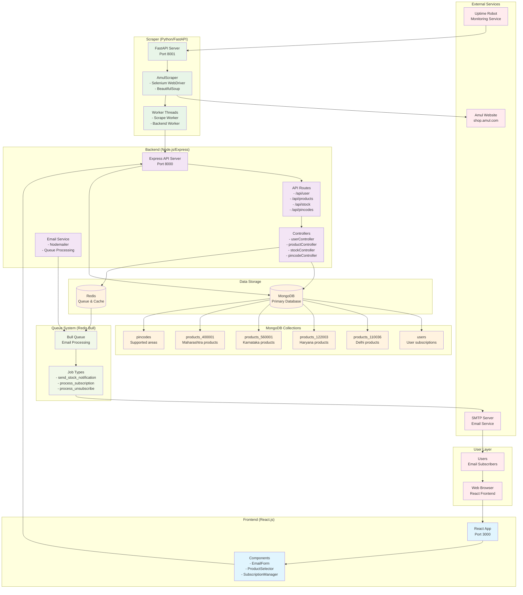

# Amul Products Notifier - System Architecture

## Architecture Diagram

## System Flow Description

### 1. User Subscription Flow

1. **User** visits the React frontend
2. **Frontend** collects email, city, and product preferences
3. **Backend API** validates and stores subscription in MongoDB
4. **Email Service** sends confirmation email via SMTP
5. **Queue System** processes email jobs asynchronously

### 2. Product Monitoring Flow

1. **Uptime Robot** triggers scraper every 10 minutes via `/scrape` endpoint
2. **FastAPI Server** queues scraping jobs for multiple pincodes
3. **AmulScraper** uses Selenium to scrape Amul website
4. **Worker Threads** process scraped data and send to backend
5. **Backend** compares with previous data to detect stock changes
6. **Queue System** processes notification jobs for affected users

### 3. Notification Flow

1. **Stock changes** detected by backend
2. **Redis Queue** manages email notification jobs
3. **Email Service** sends notifications to subscribed users
4. **Users** receive email notifications about product availability

## Key Components

### Frontend (React.js)

- **Port**: 3000
- **Components**: EmailForm, ProductSelector, SubscriptionManager, UnsubscribeButton
- **Features**: City-based product selection, subscription management

### Backend (Node.js/Express)

- **Port**: 8000
- **Database**: MongoDB with Mongoose
- **Queue**: Redis with Bull Queue
- **Email**: Nodemailer for SMTP
- **APIs**: RESTful endpoints for user management and stock tracking

### Scraper (Python/FastAPI)

- **Port**: 8001
- **Web Scraping**: Selenium WebDriver + BeautifulSoup
- **Processing**: Multi-threaded workers for scraping and data transmission
- **Monitoring**: Uptime Robot integration for continuous operation

### Data Storage

- **MongoDB**: Primary database with collections for users, products by pincode, and pincode metadata
- **Redis**: Queue management and caching for email processing

## Supported Areas

- **Delhi** (110036)
- **Haryana** (122003)
- **Karnataka** (560001)
- **Maharashtra** (400001)

## Technology Stack

- **Frontend**: React.js, React Router DOM, CSS3
- **Backend**: Node.js, Express.js, MongoDB, Redis, Nodemailer
- **Scraper**: Python, FastAPI, Selenium, BeautifulSoup
- **Infrastructure**: Uptime Robot, SMTP Email Service
